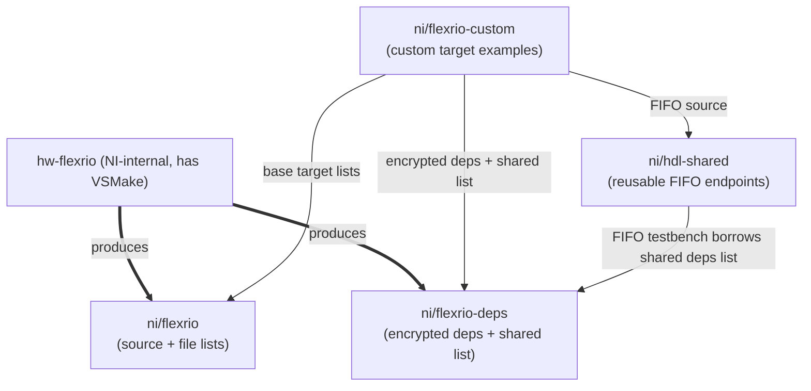
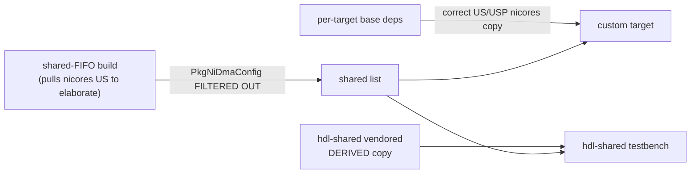

# Theory of Operation: Dependencies, File Lists, Excludes, and the GitHub Export

**Audience:** anyone touching the dependency / file-list / exclude machinery in
[`targets/build.py`](../../targets/build.py), `targets/targetsettings.py`,
`targets/lvfpgaexcludefiles.py`, or `github/hdl_shared_deps/`.

**Why this doc exists:** the GitHub-release build turns an NI-internal VSMake build into a
set of file lists and encrypted dependency files that let an *external* customer rebuild a
custom FlexRIO FPGA target on GitHub, without VSMake and without access to NI IP in the
clear. The code that does this is spread across several functions and two exclude-pattern
files, and the *why* is not obvious from any single spot. This is the big picture.

> Companion doc: [githubreleasebuild/GitHub_Release_Build.md](githubreleasebuild/GitHub_Release_Build.md)
> covers the release *pipeline* (branches, push steps). This doc focuses on the **dependency
> and file-list logic** feeding it.

---

## 1. The repos and who depends on whom

| Repo | Location | Role |
|---|---|---|
| **hw-flexrio** | NI-internal (this repo) | Builds the FlexRIO targets with **VSMake**. Produces the two GitHub exports below. |
| **ni/flexrio** | GitHub | Per-target **source** + generated **file lists** (`vivadoprojectdeps.txt`, `vivadoprojectsources.txt`, `lvtargetexcludefiles.txt`). |
| **ni/flexrio-deps** | GitHub | The **encrypted** dependency VHDL, plus `hdl_shared_deps_list/` (the shared DMA-FIFO deps list). |
| **ni/flexrio-custom** | GitHub | Customer-facing **example** custom targets. *Consumes* flexrio + flexrio-deps + hdl-shared. |
| **ni/hdl-shared** | GitHub | Reusable, product-line-agnostic **DMA FIFO endpoints** (`NiSharedFifo*`) + testbenches. *Consumes* flexrio-deps (the shared list). |



**Key constraint:** VSMake (the NI tool that walks an entity's hierarchy to compute its
dependency closure) exists **only inside NI**. Public repos (flexrio-custom, hdl-shared)
cannot resolve their own dependencies — they must consume a list that hw-flexrio computed.
This is why hdl-shared borrows a deps list from flexrio-deps; that coupling is irreducible.

---

## 2. The two VSMake builds

The GitHub-release flow runs VSMake **twice**, for two different tops:

1. **Per-target synth** — [`vsmake_synth_buildgithub`](../../targets/build.py). Top = the
   real target top (`MacallanTop`, `AppletonTopTemplate`, ...). Produces
   `objects/<target>/vsmake/absfiles_<toplevel>.json` — the target's full dependency closure.

2. **Shared FIFO deps** — [`vsmake_shared_deps`](../../targets/build.py). Top =
   `HdlSharedWrapper` (an instantiation-only wrapper in
   `github/hdl_shared_deps/rtl/HdlSharedWrapper.vhd` that instantiates the DMA FIFO endpoints
   so VSMake pulls their dependency closure). Produces `absfiles_HdlSharedWrapper.json`.

Why two builds? The base target top does **not** instantiate the user DMA FIFO endpoints
(those are added by the customer's HDL later). So the FIFO endpoints' dependency closure has
to be computed separately, from a wrapper that *does* instantiate them.

---

## 3. From `absfiles_*.json` to shipped file lists

[`_process_vsmake_file_lists`](../../targets/build.py) runs
`githubbuildtools.process_vsmake_file_list` on each `absfiles_*.json` and turns it into the
lists a customer's Vivado project needs. For each build it does, in order:

1. **Pre-filter** (`pre_filter_regex_list`) — drop files that must never appear in the output
   list at all (see §4). Only the shared-FIFO build uses one
   (`HDL_SHARED_DEPS_PRE_FILTER_REGEX_LIST`).
2. **Split source vs deps** by the `githubvisible=true` tag:
   - **source** files (customer-editable) → `vivadoprojectsources.txt`, shipped as plaintext in ni/flexrio.
   - **dependency** files (NI IP) → `vivadoprojectdeps.txt`, later **encrypted** into ni/flexrio-deps.
3. **Compute the LV-target exclude list** (`lvtargetexcludefiles.txt`) by matching the file
   list against the exclude-pattern module (see §5).
4. **Write a dependency manifest** (`depspathmanifest.json`) that records, for every dep, its
   original path and its (possibly shortened/hashed) published path under
   `deps/flexrio-deps/encrypted/`. Path shortening (`DEPS_MAX_REL_PATH_LEN`, hashing) keeps
   Windows long-path limits happy while keeping same-named files from different sources distinct.

Outputs land in `objects/<target>/githubfilelists/` (and `objects/hdl_shared_deps/githubfilelists/`).

---

## 4. Pre-filter: files pulled for elaboration but not shipped

`HDL_SHARED_DEPS_PRE_FILTER_REGEX_LIST` removes files that the shared-FIFO build **needs to
compile `HdlSharedWrapper`** but must **not** ship in the shared list:

| Pattern | Why filtered |
|---|---|
| `HdlSharedWrapper.vhd` | Instantiation-only scaffold — a build artifact, not a real dep. |
| `NiFifo(Reader\|Writer)Core.vhd` | The FIFO endpoints themselves come from **hdl-shared**, not flexrio-deps. |
| `/lvgen/` | LabVIEW-FPGA-generated files, provided at compile time. |
| `PkgNiDmaConfig.vhd` | **DMA-family-specific** (US vs USP) *and* the wrong variant — see §6. |

---

## 5. Exclude lists: files LabVIEW FPGA provides at compile time

Separate from the pre-filter, each build produces an **LV-target exclude list**
(`lvtargetexcludefiles.txt`) — the set of files that **must be removed from the LabVIEW FPGA
target plugin** because LV FPGA provides its *own* copies at compile-worker time (shipping
duplicates would double-define them). The patterns live in two Python modules:

- `targets/lvfpgaexcludefiles.py` — **target** infrastructure (`TheWindow`, `/lvgen/`, the DMA
  port comm interface, `DFlop`/`DoubleSync`/`DualPortRAM`/`PkgNi*` primitives, `Dram2DP`, ...).
- `github/hdl_shared_deps/hdlsharedfifoexcludefiles.py` — **DMA FIFO endpoint** infrastructure
  (`Handshake`/`PulseSync`/`ResetSync` CDC, `NiFpga*`, `NiSharedFifo*`, `LutRamFifoFlags`,
  `TimeoutManager`, and supporting packages).

Each build applies its own module. Because a **custom target combines a base target and the
DMA FIFO endpoints**, it ships **both** exclude lists and the customer's `nihdlsettings.py`
adds **both** — the *union* happens at the consumer:

```python
config.add_lv_target_exclude_files(f"{base_deps}/lvtargetexcludefiles.txt")            # target
config.add_lv_target_exclude_files(".../hdl_shared_deps_list/hdlsharedlvtargetexcludefiles.txt")  # FIFO
```

> The two pattern groups intentionally **overlap** on shared primitives (both the target and
> the FIFO endpoints depend on `DFlop`, `DoubleSync`, the DMA port comm interface, etc.). That
> is expected — de-dup happens by basename in the plugin generator.

---

## 6. The `PkgNiDmaConfig` special case (the tricky one)

There are **two** `PkgNiDmaConfig.vhd` in play, with the **same package interface** but
**different values**:

| Variant | Path | `kNiDmaInputMaxTransfer` |
|---|---|---|
| **nicores_nidmaip** | `PCIe/{US\|USP}/{inchworm}/Source/PkgNiDmaConfig.vhd` | hardcoded `1024`; **family-specific**; does not ship in the LV plugin |
| **fpgaDigitalDesigns** | `DmaPortCommInterface/.../PkgNiDmaConfig.vhd` | **derived** `:= kInputMaxTransfer` (from `PkgCommIntConfiguration`); what LV FPGA actually compiles |

`targetsettings.py` deliberately removes the fpgaDigitalDesigns copy and uses the nicores copy
for the FlexRIO base target (search `do_files` for the `PkgNiDmaConfig` removes). That is fine
*for the target itself*. The problem is downstream:

- The shared-FIFO build had to pull a **US nicores** copy just to elaborate `HdlSharedWrapper`,
  and it **leaked into the shared list**. That caused **two** bugs:
  1. **USP custom targets** got a US `PkgNiDmaConfig` colliding with their own (USP) copy →
     they had to *manually delete* it (an `add_exclude_hdl_file_list`/`vivadoprojectexclude.txt`
     in flexrio-custom — now removed).
  2. **hdl-shared's FIFO testbench** simulated with the **hardcoded 1024** value while its own
     `PkgCommIntConfiguration` had the real derived value → a config mismatch vs. the real design.

**The fix (current):** `PkgNiDmaConfig.vhd` is in `HDL_SHARED_DEPS_PRE_FILTER_REGEX_LIST`, so it
is used for elaboration but **never shipped in the shared list**. Each consumer then supplies
its own, correct copy:

- **Custom targets** get the correct US/USP nicores copy from their **own per-target deps**.
- **hdl-shared** vendors the **derived** fpgaDigitalDesigns copy in
  `host_interfaces/fifo/HDL/testbench/lvgen/PkgNiDmaConfig.vhd`, matching what LV FPGA compiles.



---

## 7. Gathering and encrypting the dependency files

[`_gather_dependency_files`](../../targets/build.py) aggregates every build's
`depspathmanifest.json` (all per-target manifests **plus** the shared-FIFO manifest) and copies
each referenced dep file into a single folder, preserving enough hierarchy (via the manifest's
published paths) that same-named files from different sources stay distinct.

- During a **release** build the gathered files go into a `source/` folder (plaintext, staged).
- [`encrypt_deps`](../../targets/build.py) then runs `encrypt-vhdl-vivado` (IEEE-1735v2) to
  produce the `encrypted/` folder that ships in **ni/flexrio-deps**. Nothing reaches GitHub in
  the clear — [`_validate_encrypted_files`](../../targets/build.py) enforces this before push.

---

## 8. The two GitHub outputs and their branches

| Output | Branch (staging → GitHub) | Contents |
|---|---|---|
| **Targets** | `ni/githubstaging/flexrio` → `ni/flexrio` | Per-target source + `vivadoprojectdeps.txt` / `vivadoprojectsources.txt` / `lvtargetexcludefiles.txt` (copied from `objects/` by [`_copy_object_files_for_github`](../../targets/build.py)). |
| **Deps** | `ni/githubstaging/flexrio-deps-source` → encrypt → `ni/githubstaging/flexrio-deps` → `ni/flexrio-deps` | The encrypted dep VHDL + `hdl_shared_deps_list/` (shared deps list + shared exclude list, copied by [`_copy_object_files_for_github_deps`](../../targets/build.py)). |

[`build_release_branch`](../../targets/build.py) builds the targets branch;
[`build_deps_branch`](../../targets/build.py) builds the deps-source branch; `encrypt_deps`
produces the encrypted deps branch; `push_*_to_github` push both to GitHub.

---

## 9. How a custom target consumes it all

A custom target's `nihdlsettings.py` (in flexrio-custom) assembles the Vivado/ModelSim file
list from four sources:

```python
config.add_hdl_file_list(f"{base_deps}/vivadoprojectdeps.txt")   # base target deps (incl. correct PkgNiDmaConfig)
config.add_hdl_file_list("vivadoprojectsources.txt")             # the customer's own HDL
config.add_hdl_file_list(".../hdl_shared_deps_list/hdlsharedvivadoprojectdeps.txt")  # DMA FIFO deps
# + the customer's FIFO instantiations, which come from the ni/hdl-shared dependency
config.add_lv_target_exclude_files(f"{base_deps}/lvtargetexcludefiles.txt")          # target excludes
config.add_lv_target_exclude_files(".../hdl_shared_deps_list/hdlsharedlvtargetexcludefiles.txt")  # FIFO excludes
```

- **US targets:** their base-deps `PkgNiDmaConfig` and (formerly) the shared one were the same
  US file → deduped, no action.
- **USP targets:** used to need an explicit exclude of the US copy. With `PkgNiDmaConfig`
  filtered from the shared list (§6), that exclude is gone — the base-deps USP copy is the only
  one.

The **hdl-shared FIFO testbench** consumes `hdlsharedvivadoprojectdeps.txt` for the rest of the
FIFO deps, and its own vendored `PkgNiDmaConfig` for the config (§6).

---

## 10. File glossary

| File | Produced by | Purpose |
|---|---|---|
| `absfiles_<top>.json` | VSMake | Raw dependency closure of a top entity. Input to processing. |
| `vivadoprojectdeps.txt` | processing | NI-IP dependency files (encrypted). Added to the Vivado project. |
| `vivadoprojectsources.txt` | processing | Customer-editable source files (plaintext). |
| `lvtargetexcludefiles.txt` | processing | Files to drop from the LV FPGA target plugin (LV provides them). |
| `depspathmanifest.json` | processing | Original→published path map for gathering/encrypting deps. |
| `hdlsharedvivadoprojectdeps.txt` | shared-FIFO build | DMA FIFO endpoint deps, consumed by custom targets **and** hdl-shared's testbench. |
| `hdlsharedlvtargetexcludefiles.txt` | shared-FIFO build | FIFO exclude list, unioned by custom targets. |

---

## 11. Where the code lives (quick map)

| Concern | Location |
|---|---|
| Pre-filter (incl. `PkgNiDmaConfig`) | `HDL_SHARED_DEPS_PRE_FILTER_REGEX_LIST` in `targets/build.py` |
| Per-target + shared file-list processing | `_process_vsmake_file_lists` / `_process_vsmake_file_lists_core` |
| Target exclude patterns | `targets/lvfpgaexcludefiles.py` |
| FIFO exclude patterns | `github/hdl_shared_deps/hdlsharedfifoexcludefiles.py` |
| FIFO wrapper (elaboration only) | `github/hdl_shared_deps/rtl/HdlSharedWrapper.vhd` |
| Which `PkgNiDmaConfig` the base target uses | `targets/targetsettings.py` (`do_files`) |
| Gather / encrypt / push | `_gather_dependency_files`, `encrypt_deps`, `build_release_branch`, `build_deps_branch` |
