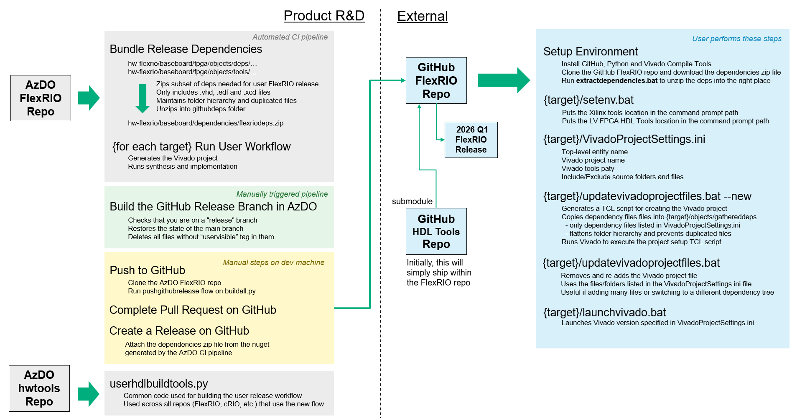

Note: This <b>githubvisible=true</b> tag ensures that this file is preserved for the GitHub releas

# User Visible FlexRIO Releases on GitHub

## Dependencies

Dependencies is a complicated part of the release process.  We have many files duplicated across all the dependencies for the FlexRIO repo.  For example, ni cores are pulled in from a normal ni cores export and also they are re-packaged within the FPGA Digital Designs export.  Different FlexRIO products may choose to depend on different versions of these files.  

In our internal process, we use hwtools to pull all of the dependencies from Perforce and Nugets into one folder.  And then each product has a vsmake settings file that specifies which files from within those dependencies are used for a pariticular FPGA build.  The dependencies have very deep folder hierarchies and Vivado has trouble with long file paths.  To mitigate this, our internal tools copy the files used for the Vivado build into a single flat gatheredfiles folder.

Our user facing process will mirror what we do in HW tools in a simpler way.  For example, internal hwtools needs to pull dependencies from a variety of sources that NI has created over the years.  For the user facing workflow, we will bundle all of those dependencies into ONE export object and give that to the user.  This means their tools won't require all the dependency syncing complexity of NI's internal process.

### <u>Build Flow for Generating User Dependencies</u>

### <u>User Flow for Getting Dependencies into Vivado Projects</u>

## Repo and Tool Structure

## Release Process

1. Run the <b>hw-flexrio-baseboards-ci</b> pipeline
    * These steps are automated:
        * Runs bundlereleasedeps.py to aggregate the dependencies used by products in the FlexRIO GitHub release into a zip file
        * Unzips that zip file so that later pipeline steps can test the userworkflow
        * Runs the update_project_files user tools function to create a new Vivado project
        * Runs a synthesis script to ensure that the Vivado project has all of the necessary dependency files
2. Run the <b>hw-flexrio-baseboards-buildgithubrelease</b> pipeline
    * These steps are automated:
        * Creates a filtered release branch that only contains files with the "githubvisible=true" tag
    * The pipeline has a <b>commit_message</b> variable which shows up on all of the files that are pushed to GitHub.  As you are developing and pushing to main in AzDO, those commit messages will not show on GitHub.  Make sure you have a good commit message that describes all of the changes that are being pushed into the release branch.  It is ideal for you to have more incremental AzDO release branch pushes rather than one mega-push that contains lots of changes.
    * Optionally review the release branch in AzDO
3. Push to GitHub
    * This is not supported in the AzDO pipeline yet becuase it requires a user's GitHub credentials
    * Here are the steps to manually run the push script:
        > git clone https://ni@dev.azure.com/ni/DevCentral/_git/hw-flexrio
        >
        > cd hw-flexrio/baseboards/fpgas
        >
        > git checkout users/ssantolu/flexrionew <-- replace this with MAIN branch later
        >
        > hwsetup
        >
        > python buildall.py --flow=pushgithubrelease
4. On GitHub, complete the pull request
    * Review and sanity check that things look OK
5. On GitHub, create a release that contains the bundled dependencies zip file
    * Download the nuget from the CI pipeline run in Step #1
    * Change the extension to a .zip
    * Extract the deliverables\githubflexrioreleasedeps\flexriodeps.zip file
    * Create a Release on GitHub and attach the zip file 

## User Workflow
### Prerequisites
1.	Install latest version Git  – https://git-scm.com/downloads
2.	Install Python (version XYZ officially tested) –  https://www.python.org/downloads/
3.	Install LabVIEW FPGA Compilation tool for Vivado 2021.1 – https://www.ni.com/en/support/downloads/software-products/download.package-manager.html

### Phase 1 – Clone the FlexRIO GitHub repo
1.	Go to the FlexRIO repo on GitHub – https://github.com/ni/flexrio-test
2.	Copy the repo HTTPS URL to clipboard
3.	Open a command prompt in C:\dev\github
4.	Clone the FlexRIO GitHub repo:
    > git clone <b>[paste FlexRIO GitHub repo URL]</b>
    >
    > git clone https://github.com/ni/flexrio-test.git

### Phase 2 – Install the FlexRIO dependencies
1.	Download the dependencies zip file from the latest FlexRIO release:
2.	Put the zip file into this folder:
    > C:\dev\github\flexrio-test\dependencies
3.	Open a command prompt at the PXIe-7903 folder:
    > C:\dev\github\flexrio\baseboards\fpgas\source\fpga\pxie-7903
    * Note: the PXIe-7903 folder is the working directory where you will run all commands
4.	Run the setenv script to setup the tools into your command path
    > setenv
    Note: run setenv each time you create a new command prompt
5.	Run the script to extract the dependencies zip file into your FlexRIO folder:
    > extractdependencies 

### Phase 3 – Create and Build the Vivado Project
You may skip steps 1 &2 if continuing from the previous phase
1.	Open a command prompt at the PXIe-7903 folder:
    > C:\dev\github\flexrio\baseboards\fpgas\source\fpga\pxie-7903
    * Note: the PXIe-7903 folder is the working directory where you will run all commands
2.	Run the setenv script to setup the tools into your command path
    > setenv
    * Note: run setenv each time you create a new command prompt
3.	Create the Vivado Project:
    > createvivadoproject
4.	Launch Vivado:
    > launchvivado
5.	In the Vivado IDE, click <b>Synthesize</b>

## FAQ
### Why don't we leverage hwtools for the user-facing side of the workflow?
### Why are the user FlexRIO dependencies delivered in a zip file?

